# UAV Flight-Link System — Sơ đồ kiến trúc & Phân kỳ Implementation

> File này trực quan hóa kiến trúc hệ thống và cho thấy hệ thống "lớn dần" qua từng phase như thế nào. Dùng kèm với `PROJECT_PLAN.md` (chi tiết task) và `README.md` (tổng quan).

## 1. Sơ đồ kiến trúc tổng thể (mục tiêu cuối cùng)

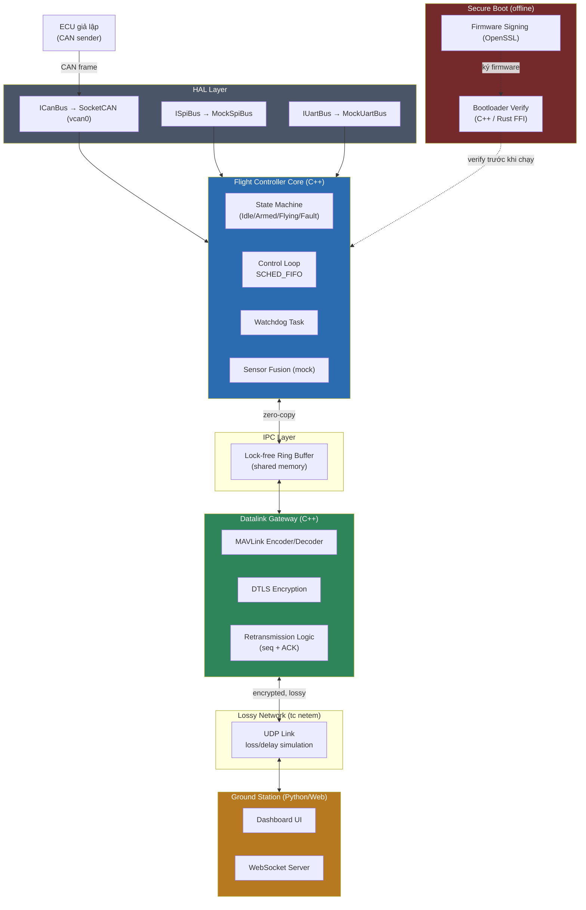

## 2. Kiến trúc theo tầng (layer view — tinh thần AUTOSAR)

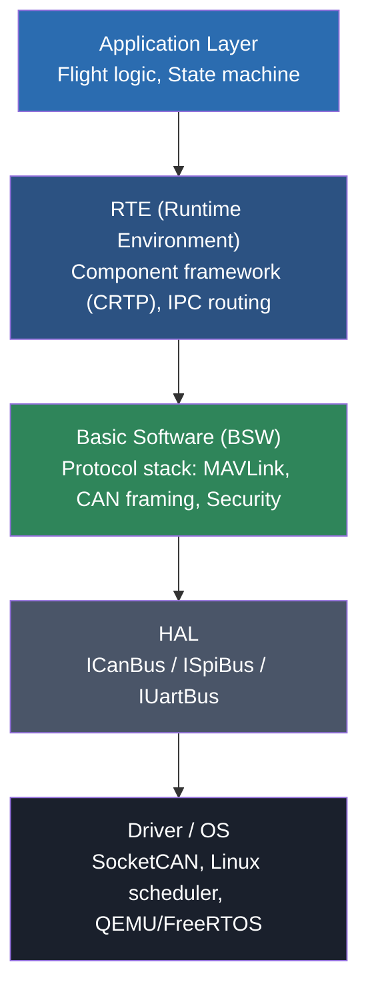

---

## 3. Hệ thống lớn dần qua từng Phase

### Phase 0 — Khung project
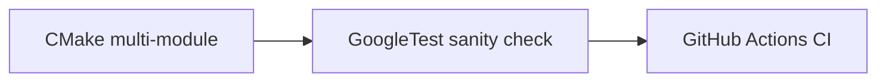
**Có gì chạy được:** build sạch, 1 test giả, CI xanh. Chưa có logic thật.

### Phase 1 — Modern C++ Core
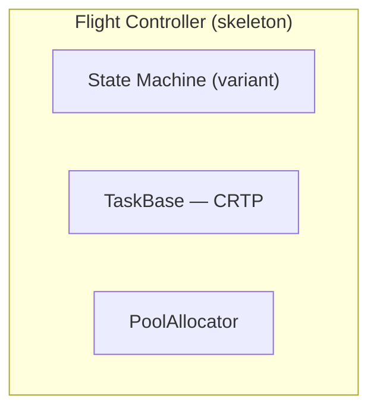
**Có gì chạy được:** State machine transition test, benchmark CRTP vs virtual, xác nhận zero heap alloc.

### Phase 2 — HAL
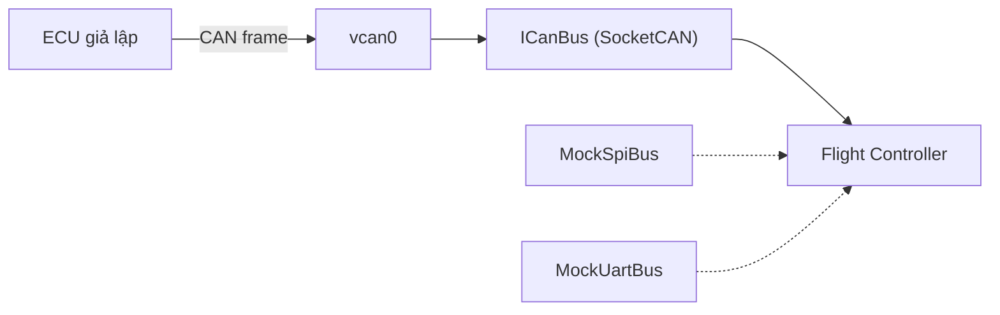
**Có gì chạy được:** CAN frame thật đi qua vcan0, Flight Controller parse được. SPI/UART là mock nhưng interface đã đúng chuẩn để swap sau này.

### Phase 3 — RTOS / Real-time
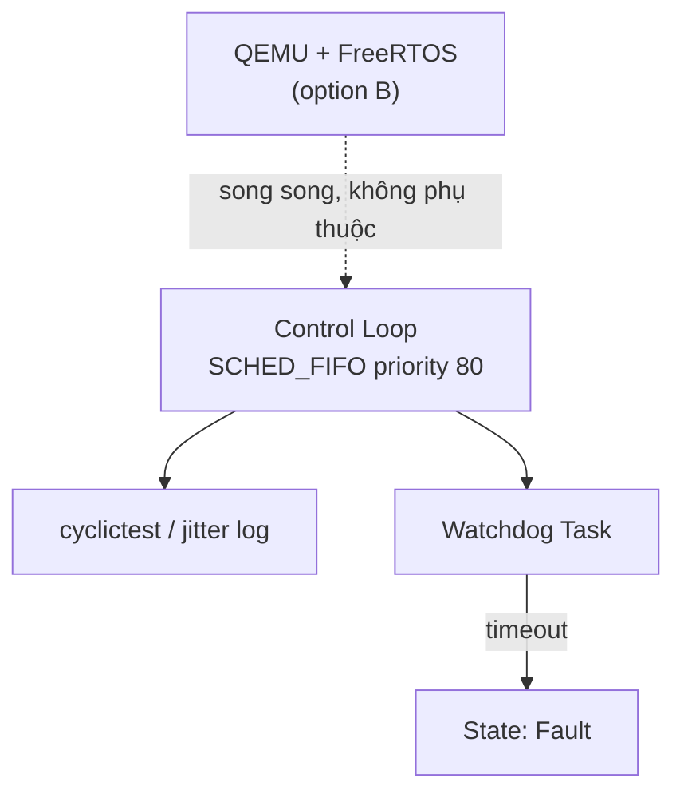
**Có gì chạy được:** số liệu jitter thật SCHED_FIFO vs SCHED_OTHER, watchdog chuyển state khi control loop treo. QEMU/FreeRTOS là nhánh phụ, độc lập.

### Phase 4 — Giao thức & Datalink
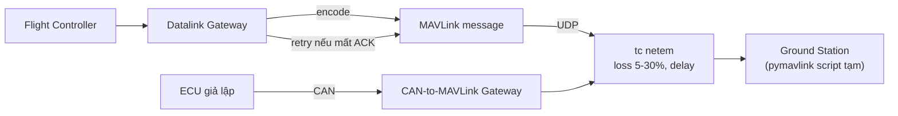
**Có gì chạy được:** MAVLink thật trên wire (thấy được bằng Wireshark), retransmission hoạt động dưới điều kiện mất gói, có thêm nhánh CAN-to-MAVLink minh họa gateway pattern.

### Phase 5 — Zero-copy IPC
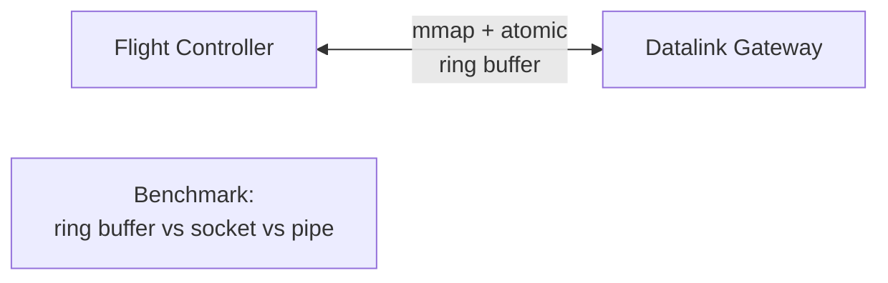
**Có gì chạy được:** đường truyền nội bộ FC↔Gateway chuyển từ socket sang ring buffer, có số liệu benchmark latency/throughput thật.

### Phase 6 — Bảo mật
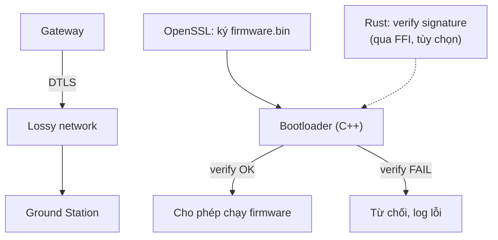
**Có gì chạy được:** traffic bắt bằng Wireshark không đọc được plaintext, bootloader từ chối firmware bị sửa đổi.

### Phase 7 — Video pipeline (tùy chọn)

**Có gì chạy được:** video chạy qua đường truyền băng thông hạn chế, đo được bitrate/latency/frame drop.

### Phase 8 — Ground Station thật
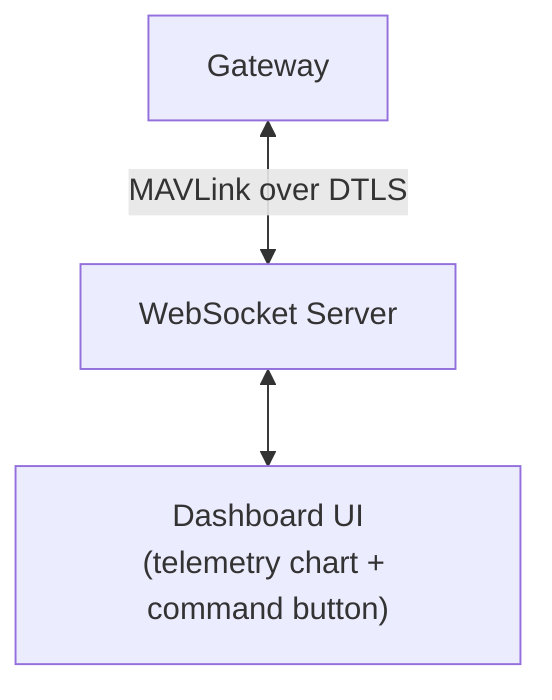
**Có gì chạy được:** demo end-to-end live — mở dashboard thấy telemetry cập nhật real-time, gửi lệnh thấy phản hồi.

### Phase 9 — Hoàn thiện
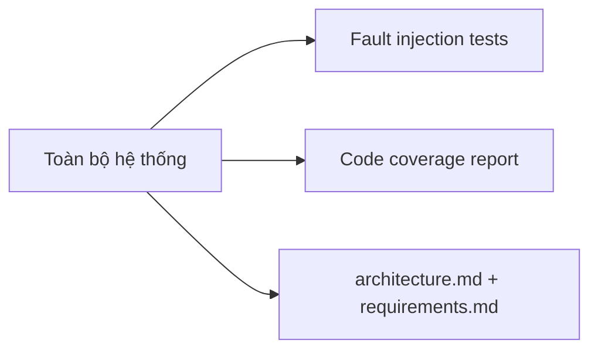
**Có gì chạy được:** hệ thống đầy đủ, có test fault injection, coverage report, tài liệu kiến trúc hoàn chỉnh.

---

## 4. Bảng map: Component ↔ Phase ra đời ↔ Kiến thức ôn lại

| Component | Ra đời ở Phase | Kiến thức chính |
|---|---|---|
| CMake + CI | 0 | Build system, static analysis |
| StateMachine, TaskBase (CRTP), PoolAllocator | 1 | Modern C++, memory model |
| ICanBus/ISpiBus/IUartBus + Mock/SocketCAN | 2 | HAL pattern, CAN protocol |
| SCHED_FIFO control loop, Watchdog | 3 | RTOS, real-time scheduling |
| FreeRTOS on QEMU (tùy chọn) | 3 | Bare-metal RTOS thật |
| MAVLink encode/decode, retransmission | 4 | Protocol design, datalink |
| CAN-to-MAVLink Gateway | 4 | Gateway pattern (automotive ↔ UAV) |
| Ring buffer (mmap + atomic) | 5 | IPC, lock-free, zero-copy |
| DTLS encryption | 6 | Datalink security |
| Bootloader + firmware signing | 6 | Secure boot |
| Rust FFI verify module (tùy chọn) | 6 | Đa ngôn ngữ, memory-safe interop |
| GStreamer pipeline (tùy chọn) | 7 | Video compression, bandwidth |
| Dashboard UI + WebSocket | 8 | System integration |
| Fault injection, coverage, docs | 9 | ASPICE-style rigor |

---

## 5. Cách dùng file này

- Khi bắt đầu một Phase mới, mở lại đúng sơ đồ Phase đó để nhớ component nào cần nối với component nào.
- Khi trình bày trong phỏng vấn, có thể vẽ tay lại sơ đồ Phase 9 (đầy đủ) từ trí nhớ — nếu vẽ được nghĩa là đã hiểu hệ thống đủ sâu.
- Sơ đồ này render trực tiếp trên GitHub (Mermaid được hỗ trợ native trong `.md`), không cần công cụ ngoài.
